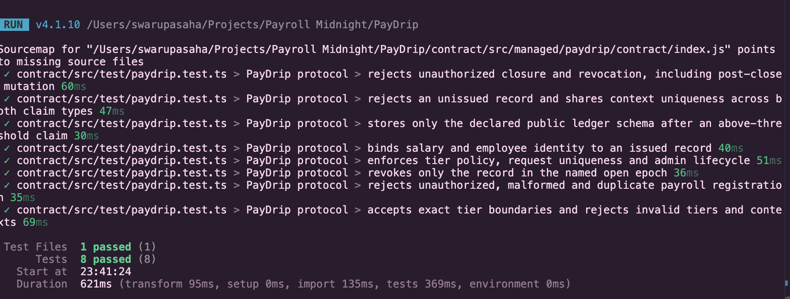
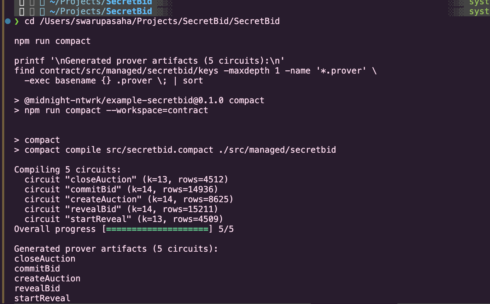

# PayDrip

**Payroll belongs on-chain. Salaries don't.**

[](https://github.com/swarupasaha2005-hue/motumon/actions/workflows/ci.yaml)

PayDrip is a Midnight dApp for employer-authorized private payroll records and selective income or historical employment claims. An employee can prove that an authorized record meets a supported income threshold without publishing the exact salary in contract state.

**Provided idea: Private Payroll / Splits.** V1 implements records and claims; payment splits and confidential salary transfers are outside its scope.

## Live Demo

[Open PayDrip](https://pay-drip.vercel.app/) → **Launch App**.

This is the configured public **interface demo**. It supports the separate 1AM wallet/session flow; hosted circuit submission and claim lookup are disabled because the transaction path requires the local service, operator and proof server. Private payroll inputs are not uploaded to Vercel. Current public-build freshness and accessibility were not established in the latest restricted environment.

For real Preview circuit execution, use [Local Development](#local-development). The implementation is wired to all six circuits, but a successful payroll claim and its public transaction disclosure still require runtime verification. A previously checkpointed, unverified epoch submission is not successful claim evidence.

## Demo Video

**Not recorded / no video URL supplied.** Use the [60-second recording script](docs/submission/LEVEL3_DEMO_SCRIPT.md) after the real Preview flow succeeds. Do not substitute illustrations or mocked tests for a confirmed claim.

## Why PayDrip

Income checks often ask for a complete payslip when a narrow eligibility answer would suffice. Public on-chain payroll can expose compensation and relationships. PayDrip separates the employer's private payroll record from the public authorization handle and the employee's selectively disclosed claim.

Midnight's Compact circuits check the opening, authorization and income comparison using private circuit inputs. A verifier can read an accepted claim receipt without receiving the private payroll file. Issuer honesty and secure delivery of that file remain trust assumptions.

## Level 3 Track

**Private Payroll / Splits** from the supplied idea list. The [product proposal](docs/LEVEL3_PRODUCT_PROPOSAL.md) is prepared; submission and approval are pending. The [Level 3 submission pack](docs/submission/LEVEL3_SUBMISSION.md) records the evidence and remaining gates independently of Level 5/6 participant testing.

## How It Works

1. An administrator opens a public payroll period.
2. An employee generates a private identity and gives the issuer only the period-scoped pseudonym.
3. The issuer prepares a private USD payroll record, saves/delivers its opening securely, and registers a randomized commitment.
4. The employee imports the opening and matching identity, selects a supported claim, and consents to its public disclosures.
5. Compact checks the private inputs against the authorized, unrevoked commitment and records an accepted claim under a fresh request context.
6. A verifier looks up the public receipt by context.

**Example, synthetic data only:** a private $5,000 monthly record can satisfy **At least $3,000**. The public claim states Tier 1; it does not store the exact salary. Repeated tier queries can narrow the salary range.

## Privacy Model

This section describes the source-defined relation and ledger schema. Off-chain tests validate those boundaries; complete public transaction/payload inspection still needs a genuine Preview claim.

### What remains private

- Exact monthly salary, employee secret, commitment randomness and the complete private payroll opening are private circuit inputs, not public ledger fields.
- The administrator secret is checked against a public authenticator; the secret itself is not disclosed.
- Wallet seed and private-state password stay in ignored local credential files.
- PayDrip does not collect employee names, email addresses or government identifiers in the payroll record.

Private does **not** mean unknown to everyone: the issuer knows compensation; the browser holds imported inputs in session memory; the loopback service and local proof server receive private inputs for checking/proving. Explicit identity/opening downloads are sensitive plaintext files. Employees must use a machine and prover they trust, and receive openings through an authenticated private channel.

### What becomes public

- Contract address; organization, deployment domain, USD currency and administrator authenticator hash.
- Epoch IDs/status; commitment-to-epoch mappings; revoked commitment handles.
- Request contexts; claim type (`0` historical membership, `1–3` income tier); linked commitment handles.
- Transaction/block metadata available from the network.

The public claim-to-record link exposes the payroll period relationship. Employee pseudonyms are shared with the issuer and committed inside the record; they are not standalone ledger fields. See the complete [disclosure map](docs/PRIVACY.md).

### What a verifier learns

An accepted income receipt means that, at submission time, the caller had the matching employee secret and opening of an issuer-authorized, unrevoked record in an existing payroll epoch, and its salary met the selected supported threshold. Tier 1/2/3 means monthly USD base salary **≥ $3,000 / $5,000 / $10,000**. Historical membership uses the same authorization checks without an income comparison.

### What an observer cannot learn

Public contract state does not directly supply the exact salary, private record opening, employee secret, administrator secret or commitment randomness. This is a statement about the schema and verified relation, not a guarantee against auxiliary information, compromised devices or inference. The issuer and local prover are not excluded observers.

### Limitations

- Metadata and claim handles remain public and linkable; anonymity and untraceability are not promised.
- A commitment binds a record; it is **not encryption** or a recoverable backup.
- Repeated/adaptive threshold requests may reveal a salary band. Fresh contexts do not prevent probing.
- An authorized issuer can attest inaccurate real-world compensation. No payment/bank attestation exists.
- Historical membership is not current employment. Closed epochs permit claims; existing receipts survive revocation.
- Contexts are unique per accepted claim but are not bound to a named verifier or signed request policy.
- No confidential salary payment rail, tax system or payment-splits execution is implemented.

## Zero-Knowledge Design

**In plain language:** prove an approved payroll record meets a requirement, without handing the verifier the paycheck.

**In the circuit:** `requireEmployeeRecord` checks domain, organization and currency, derives the employee pseudonym from the secret/domain/epoch, recomputes `persistentCommit(record, randomness)`, checks registered membership and its epoch, and rejects revoked records. `proveIncomeTier` checks a nonzero, unused context, tier 1–3, and the private Uint64 salary against the corresponding threshold. Only the required epoch, commitment, context and tier are disclosed. All exported circuits return `[]`; the application reads their public state effect and transaction metadata rather than a returned salary or proof file.

PayDrip uses private circuit parameters; it declares no separate Compact witness functions or business private-state ledger. The SDK's local encrypted LevelDB provider serves transaction plumbing. It should not be confused with browser-private payroll storage.

## Architecture

```text
Organization → payroll epoch → private payroll record → randomized commitment
                                                       ↓
                                             PayDrip public ledger
                                                       ↑
Employee opening + secret → Compact proof → selective claim → verifier receipt

1AM ↔ browser wallet/session (Preview address; not the circuit signer)
Browser → loopback PayDrip API → local Preview operator → Midnight.js
                                      → local proof server → PayDrip on Preview
```

Browser inputs stay in memory with explicit private-file downloads. Public state is read through the Preview indexer. The local service binds to loopback and protects writes with origin checks and a per-process session token. Unknown errors are sanitized. Do not host an employee's private proving path on an untrusted issuer/backend.

[Terminal/circuit mapping](docs/WEB_TERMINAL.md) · [Protocol architecture](docs/ARCHITECTURE.md) · [Threat model](docs/PRIVACY.md).

## User Flow

### Organization

**Network & contract → Connect local operator**. Wait for genuine synchronization and usable fee resources; organization actions require the existing local administrator vault. **Payroll periods → Generate → Open period**. Obtain the employee pseudonym, then **Records → Authorize compensation**: period, pseudonym, and salary in dollars (e.g. synthetic `5000.00`, converted to `500000` cents). **Prepare private record → Download private record → Register commitment**. Securely deliver the downloaded opening. Revoke while the period is open or close the period when issuance is complete.

### Employee

**My payroll → Create a private identity → Generate pseudonym → Download private identity** for that period. Keep the identity private; share only its pseudonym with the issuer. Import the private record and identity, then **Check my record**. In **Create a claim**, select **Monthly income eligibility → At least $3,000** or **Historical payroll membership**. Paste a fresh verifier context, review **Privacy Preview**, and **Generate and submit claim**. Show success only after the actual call confirms.

### Verifier

**Verify a claim → Generate request context**; give the context to the employee. After confirmation, paste the same context and **Check contract receipt**. The result exposes the accepted claim, context, linked handle and period/issuer information; no exact salary. A missing receipt is not proof of rejection.

### Wallet and disconnect

**Connect Wallet** uses the existing 1AM DApp Connector v4 adapter, validates Preview, and displays the actual public address. It is separate from **Connect local operator**, which executes transactions. Connector method presence is not evidence of working signing.

**Disconnect** clears the browser application session and transient private inputs. Connector v4 has no revoke/disconnect API; extension permissions are managed in 1AM. Local operator disconnect stops its separate service wallet. Do not interpret either UI action as cancellation of a transaction already submitted.

## Compact Circuits

| Circuit | Purpose | Authorization |
|---|---|---|
| `openEpoch` | Open a unique payroll period | Administrator secret |
| `registerRecord` | Authorize a commitment in an open period | Administrator secret |
| `revokeRecord` | Revoke a registered handle in an open period | Administrator secret |
| `proveEmployment` | Record historical membership | Matching employee secret/opening |
| `proveIncomeTier` | Record eligibility for supported income tier | Matching employee secret/opening |
| `closeEpoch` | Stop new registration/revocation | Administrator secret |

## Midnight Deployment

| Field | Recorded evidence |
|---|---|
| Network | Midnight Preview |
| Contract | `3094e6e6e6dc2a5f91b09859a5e5b1ec8df41a9aad1511570006141c98d6ec7c` |
| SDK deployment transaction ID | `002c3679d87f1de6b7c380547088f83f5b082d3ee1a59d0bcd45519d960ed32aa5` |
| SDK-reported block | `1069550` |

The public manifest is [deployment.preview.json](deployment.preview.json). The user previously verified indexed current and deployment state on their Mac. These are deployment evidence, **not** successful payroll-circuit evidence. SDK transaction IDs and indexer transaction hashes are different fields and must not be substituted without correlation.

```sh
npm run preview:verify
```

Successful output reports `network: preview`, the configured address, `currentStateIndexed: true` and `deploymentStateIndexed: true`. It verifies the existing deployment; it neither submits a transaction nor proves a claim has executed. This agent's restricted environment cannot currently reach Preview. Keep the existing deployment; no redeployment is needed for submission documentation.

## Local Development

Prerequisites: Node **24.11.1+** (`.nvmrc`), npm, Compact compiler **0.31.1**, and Docker. Proof image: `midnightntwrk/proof-server:8.1.0`. Existing operator credentials and administrator authorization are local prerequisites; never paste them into chat or add them to Git.

```sh
npm ci
npm run paydrip:compile
docker compose -f compose.preview.yml up -d
curl -fsS http://127.0.0.1:6300/health
npm run preview:verify
npm run web:dev
```

Open **http://127.0.0.1:5173/app/**. Reuse the existing local wallet/admin vault rather than generating a replacement for a funded operator. A fresh clone has no credentials; provisioning/funding/secure opening delivery require the account owner. Inspect the existing `preview:wallet`, `preview:status` and deployment tooling before provisioning a separate instance. `preview:deploy` is not part of the current demo procedure.

`npm run preview:wallet-check` starts/stops the same service wallet without transactions and provides bounded, public synchronization diagnostics. Connection, strict synchronization and funding are separate. Both streams must synchronize; positive spendable DUST still requires an actual SDK fee estimate. The DUST stall reported on the user's Mac remains a runtime gate; diagnostics distinguish event replay from resources and time out after 15 minutes. See [diagnostic interpretation](docs/testing/README.md#dust-synchronization-diagnostics).

To stop the proof server: `docker compose -f compose.preview.yml down`.

## Testing

```sh
# Screenshot-friendly: real named protocol tests (compile first)
npm run paydrip:test -- --reporter=verbose

# Complete deterministic compile/check/typecheck/test/build gate
npm run validate
```

At the latest local validation: **8 contract tests and 61 application tests passed**. Contract tests execute generated Compact logic off chain, covering authorization, commitment integrity, private-input mismatch, income boundaries, replay, revocation and closure. Application tests cover wallet/operator lifecycle, action gating, public serialization, error redaction and runner/readiness logic with mocked network boundaries. They do not establish network execution.

Controlled 70-participant tooling is synthetic integration testing, **not human traction**, and is not a Level 3 prerequisite. No bulk completion is claimed.

### Test Screenshot

The supplied PayDrip screenshot shows **8 passing protocol tests**. These execute generated Compact logic off chain; they are not network transaction evidence. The source-map warning shown did not fail the tests.



<details>
<summary>Compilation reference from another project — SecretBid</summary>

This supplied image shows **SecretBid's five auction circuits**, not PayDrip's six payroll circuits. It is included as a reference only and must not be submitted as PayDrip compilation evidence.



</details>

## CI/CD

[PayDrip CI](.github/workflows/ci.yaml) runs on **every push**, pull request and manual dispatch: checkout, pinned Compact installation, Node setup, `npm ci`, `npm run validate`, whitespace and script syntax checks. Node comes from `.nvmrc`; compiler 0.31.1 and action commit references are pinned. No wallet credentials or Preview transactions are required. Static frontend deployment is configured separately by [vercel.json](vercel.json); this workflow does not deploy contracts or automatically operate wallets.

The badge above links to the configured repository/workflow. A hosted passing run for these uncommitted changes is **not verified**. Publish only after authorization, inspect the actual Actions result, and record its URL in the submission pack. The latest web lookup showed a minimal public repository view inconsistent with local history, so publication of the complete current project also needs confirmation.

## Security & Privacy Notes

Never publish private identity/opening files, wallet credentials, administrator secret, randomness or private-state password. `.secrets/`, `.env*`, local SDK database output and managed artifacts are ignored. `.vercelignore` excludes local credentials and proving/server code. Use only marked synthetic compensation in a recording; keep real payroll data and all secret file contents off screen.

The [threat model](docs/PRIVACY.md) documents issuer trust, record substitution, replay, lifecycle, probing, linkage and local prover trust. Runtime privacy inspection must examine the decoded schema/receipt and available public transaction representation, not merely search for a literal salary number. A full payroll claim and public payload inspection remain unverified.

## Repository Structure

| Path | Contents |
|---|---|
| `contract/src/paydrip.compact` | Six circuits and public ledger |
| `contract/src/test/` | Generated-circuit protocol tests |
| `apps/web/app/` | Existing terminal, wallet adapter and UI tests |
| `apps/web/server/` | Loopback API, operator/provider code and tests |
| `scripts/` | Deployment verification and diagnostic/integration tools |
| `docs/PRIVACY.md` | Disclosures and threat model |
| `docs/submission/` | Level 3 proposal copy, video plan, audit and submission pack |
| `.github/workflows/` | Deterministic CI and security scanning |

## Product Proposal

[PayDrip — Private Payroll / Splits](docs/LEVEL3_PRODUCT_PROPOSAL.md). **Approval status: Pending; submission not evidenced.** Copy [the prepared form text](docs/submission/LEVEL3_PROPOSAL_SUBMISSION.md) into the program's actual approval form; no approval or form URL is invented.

## Level 3 Submission

Use [LEVEL3_SUBMISSION.md](docs/submission/LEVEL3_SUBMISSION.md) as the submission source of truth and [the checklist](docs/submission/LEVEL3_CHECKLIST.md) for outstanding gates. The [commit audit](docs/submission/LEVEL3_COMMIT_AUDIT.md) verifies 18 substantive commits in local history, exceeding ten; remote publication/reviewer acceptance is separate.

**Not yet fully ready:** a confirmed Preview payroll proof/verifier flow, current live-build/publication checks, passing hosted CI, proposal approval and a recorded one-minute video remain outstanding. The supplied passing-test screenshot is included above. No Preview/Preprod migration or 50/70-user evidence is required by this Level 3 pass.

## License

[Apache License 2.0](LICENSE).
